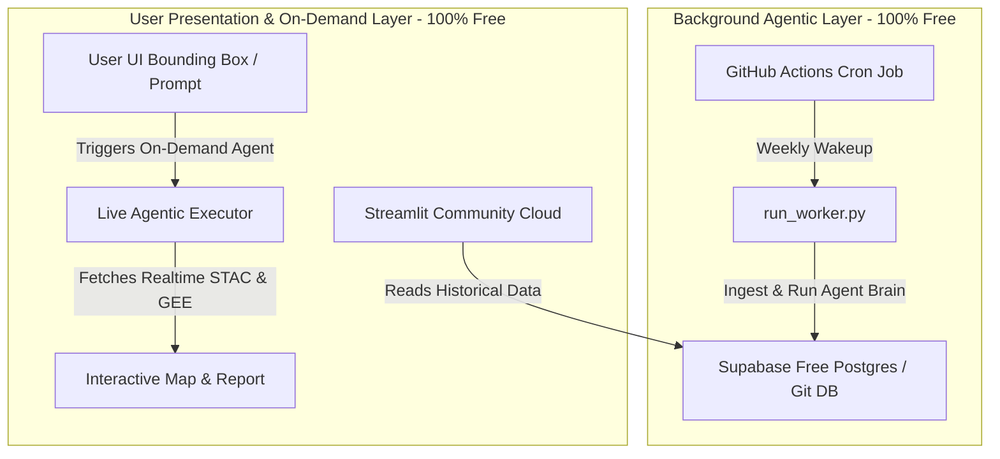

# ENSA (El Niño Sentinel Agent)
## Zero-Cost 24/7 Architecture & Self-Learning Design

### 1. The Zero-Cost Hosting & 24/7 Pipely Architecture
Running an autonomous agentic geospatial dashboard 24/7 usually requires expensive cloud servers (EC2, RDS, background workers). To make this **100% free**, we use a highly clever decoupled architecture:



* **Orchestrator (The 24/7 Engine)**: Managed entirely via **GitHub Actions** scheduled cron jobs. Every Sunday, a GHA container runs `run_worker.py`. This container has full Python, downloads forecast anomalies, executes the LLM agent evaluation, and writes the results to a database.
* **Database (Free Storage)**: We use **Supabase (Free Tier Postgres with PostGIS)** or a **Serverless Neon PostgreSQL database**. This allows the background GitHub Action worker and the user-facing Streamlit app to seamlessly read and write data with zero hosting costs.
* **Web Dashboard**: Hosted on **Streamlit Community Cloud** (free). Since Streamlit has a 1GB RAM limit, we must avoid running massive, memory-heavy raw Sentinel-2 GeoTIFF processing on the server. Instead, we offload spatial maths to **Google Earth Engine (GEE)** using the free `ee` Python client, or perform aggressive spatial downscaling to keep crop analysis strictly field-scale.

---

### 2. On-Demand vs. Scheduled Architecture
1. **Scheduled Runs (Selected Baselines)**: The background worker automatically maintains up-to-date weekly assessments for target "Hotspots" (e.g., Southern Province Zambia, Matabeleland South Zimbabwe).
2. **On-Demand Runs (User-Defined Boundaries)**: 
   - A user types a district name or coordinates in the Streamlit UI.
   - The app spins up a dynamic agent thread.
   - It queries planetary STAC catalogs or GEE for the specific bounding box over the custom timeline.
   - It performs the math (VCI, NDWI) and reports back in real-time.

---

### 3. Self-Learning & Multi-Sensor Research Framework
To make the agent truly "self-learning" and dynamically analytical, it follows a multi-sensor research flow:

#### A. The Multi-Sensor Input Matrix
The agent has access to specific analysis tools:
* **Optical (Sentinel-2 / Landsat)**: VCI (Vegetation Condition Index) showing plant vigor anomaly.
* **Radar / Passive Microwave (SMAP / Sentinel-1)**: Soil moisture anomalies reflecting root-zone water stress.
* **Precipitation (CHIRPS / ECMWF)**: SPI-3 (Standardized Precipitation Index) comparing current rainfall with 30-year historical means.
* **El Niño Amplification (ENSO Index)**: Nino 3.4 SST anomalies.

#### B. Dynamic Weighting Formula
The agent calculates a dynamic crop vulnerability score:
$$\text{Vulnerability Score} = (w_1 \cdot \text{SPI-3}) + (w_2 \cdot \text{VCI}) + (w_3 \cdot \text{Soil Moisture Anomaly})$$

* **ENSO Modulation**: If Nino 3.4 index is high (Super El Niño), the agent dynamically scales up the sensitivity threshold of $w_1$ (Precipitation) and $w_3$ (Soil Moisture) because it knows replenishment rains are highly unlikely.
* **Crop Phase Modulation**: If the crop calendar indicates the Maize crop is in its critical *flowering* phase, the agent scales up the weight of Soil Moisture ($w_3$) as immediate drought here means total crop failure.

#### C. On-The-Go Research Loop
When triggered, the agent uses a **Web Search and RAG Tool** (e.g. Tavily / DuckDuckGo / Google Scholar) to:
1. Search for active local agricultural bulletins or FAO notices in the selected district.
2. Query localized cropping calendars for non-maize regions to identify crop thresholds.
3. Compare satellite observations with actual news reports (e.g., *"Zambia declares national disaster over drought"*).

---

### 4. Database Schema Update
To support global on-demand requests and GEE/PostgreSQL integration, we update our schemas:

```sql
-- 1. Regional Targets Configuration
CREATE TABLE IF NOT EXISTS regional_targets (
    id SERIAL PRIMARY KEY,
    name VARCHAR(100) UNIQUE NOT NULL,
    bbox VARCHAR(100) NOT NULL, -- "min_lon,min_lat,max_lon,max_lat"
    is_scheduled BOOLEAN DEFAULT FALSE,
    crop_type VARCHAR(50) DEFAULT 'Maize',
    created_at TIMESTAMP DEFAULT CURRENT_TIMESTAMP
);

-- 2. Forecast & EO Metrics
CREATE TABLE IF NOT EXISTS regional_metrics (
    id SERIAL PRIMARY KEY,
    target_id INTEGER REFERENCES regional_targets(id),
    record_date DATE NOT NULL,
    nino34_sst FLOAT,
    spei3_predicted FLOAT,
    vci_observed FLOAT,
    soil_moisture_anomaly FLOAT,
    estimated_damage_pct FLOAT,
    created_at TIMESTAMP DEFAULT CURRENT_TIMESTAMP
);

-- 3. Agent Thought Log & Journal
CREATE TABLE IF NOT EXISTS agent_journal (
    id SERIAL PRIMARY KEY,
    target_id INTEGER REFERENCES regional_targets(id),
    journal_date DATE NOT NULL,
    forecast_weeks_ahead INTEGER,
    predicted_vs_actual_error FLOAT,
    search_findings TEXT, -- Summary of academic/news research performed on-the-go
    agent_thoughts TEXT, -- LLM chain-of-thought analysis
    adjusted_weights VARCHAR(100), -- JSON representation of adjusted weights (w1, w2, w3)
    created_at TIMESTAMP DEFAULT CURRENT_TIMESTAMP
);
```
